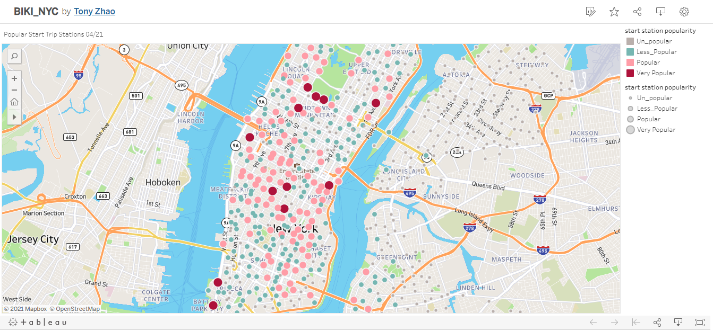
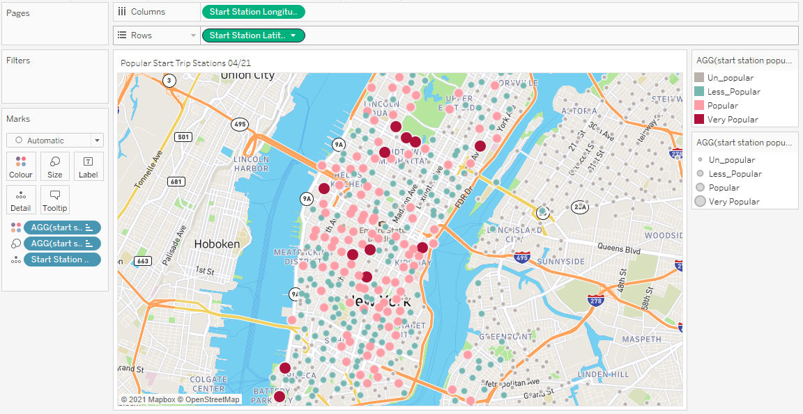

# Tableau - Citi Bike Analytics

## Tony Zhao finished on 10/05/2021

* The Tableau link of the task is : 
    
    [BIKI_NYC](https://public.tableau.com/app/profile/tony.zhao2691/viz/BIKI_NYC/Map_PopularStartStations0421)
    
    
  

## Task details as follows:

* The task has been done as follows:

    * 4-10 Total "Phenomenon" Visualizations.
        * 3 Dashboards presented!
        * 2 City maps for Top popular start and end stations separately.
        * Two stories presented, one for the story of CityBike 04/21, one for the abnormal data found.    
        
* The data selected is the latest one-month data of 04/2021 from https://www.citibikenyc.com/system-data.

* 12 discovered phenomena with the timespan of 04/2021.

* The Popular Start trip Stations, both with maps and bar charts;

    
    
    The Top 10 Popular Start/End stations are all near large transit and tourist
    hubs, including the stations near Central Park, Penn Station and the Port Authority, Pershing
    Square, and the area around Union Square. As has been the pattern, the least frequented
    Start/End stations are in Brooklyn and Queens.

* The Popular End trip Stations, both with maps and bar charts;
    
    The Top 10 popular End Stations as above.

* The busiest dates in the month;

    The busiest date in the month was 24/04/2021, with 101,586 trips recorded;

* The Busiest hours in days of the month;

    The Busiest hours in the month were around 21:00 - 22:00;

* The most often(times) used bike IDs;

    The majority often used Bike IDs within the range of 34720 - 34900 and 47470 - 54800;

* The longest trip duration used bike IDs; 

    The longest trip duration used bike IDs less than 20 with sum trip duration more than 440hours in the month;

* The User type breakdown in terms of trip counts;

    The majority riders were customers(>95%), rather than subscribers (<5%) in terms of trips proportion distribute.

* 3 Dashboards presented;

* 2 stories submitted, one for The Story of 04/21; one for the Defect Data Found;

* Within the Story of Defected Data Found, 3 data visualizations presented looks like the data's Birth Year column inaccurate,
    and the gender records were too rough with majority gender as unknown.
